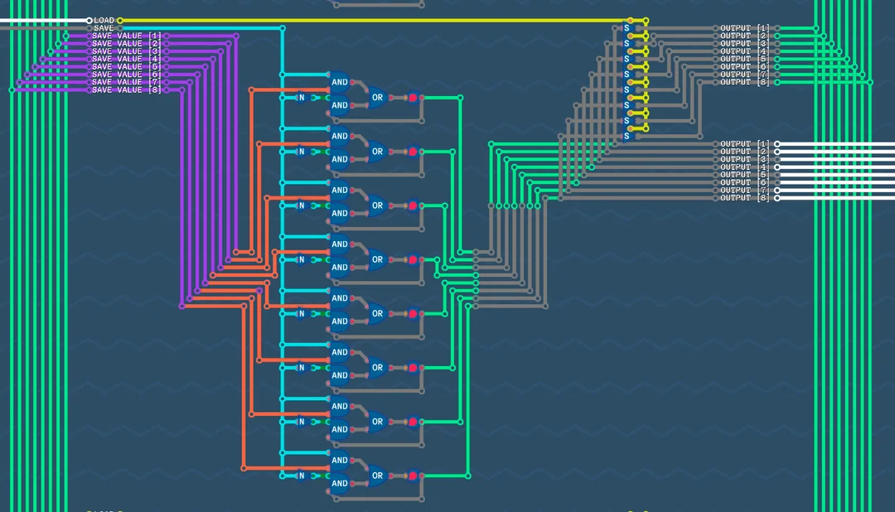
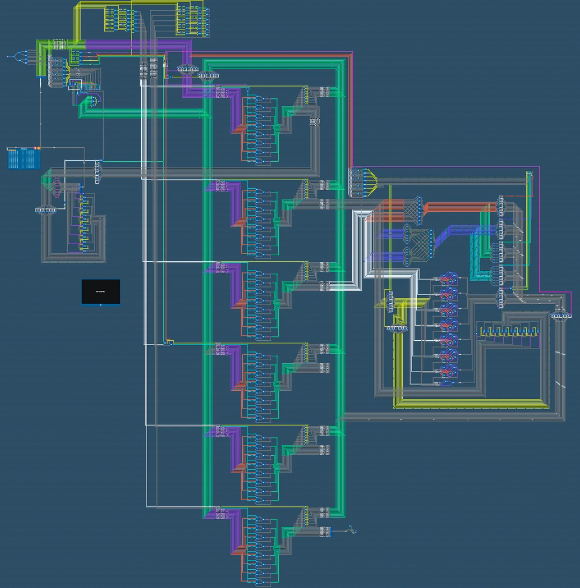
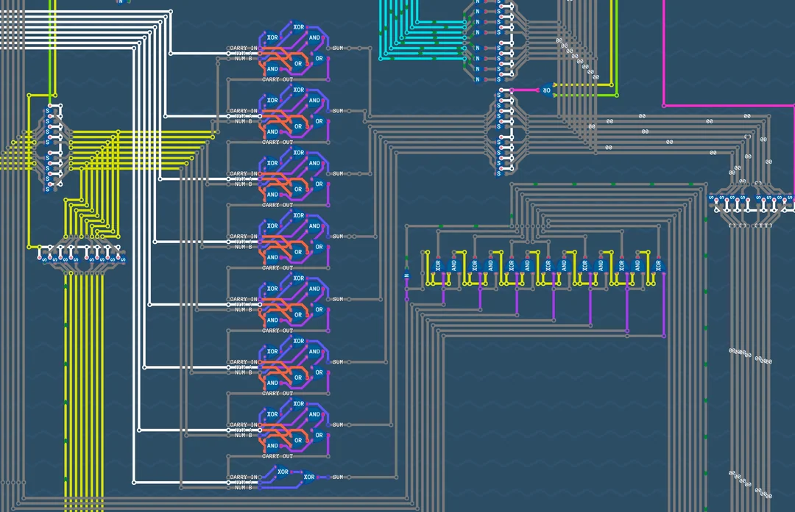

# Minimal Abstraction 8Bit CPU

This project was sparked by the university courses INCO Information Theory and Encodings and GED Basics of Electrical and Digital Technology. They triggered a strong interest in low level systems and computer architecture.

A friend recommended the game [Turing Complete](https://store.steampowered.com/app/1444480/Turing_Complete/), which acts as an educational CPU design environment. Instead of providing explicit instructions, it forces you to derive solutions from truth tables and first principles. Concepts like opcodes, instruction decoding and control logic are introduced gradually and implicitly.

The game encourages the use of custom components. For example, once a half adder is built, it can be abstracted and reused instead of manually placing the same logic gates again. While this is practical, I deliberately avoided most abstraction.

My goal was to design a CPU where all inner workings are visible at once. The emulator does not support inlining components, so every single bit level component was placed and wired manually. This took several dozen hours.

The result is a fully functional 8Bit CPU architecture called OVERTURE within TC. It is a predecessor to the more advanced LEG which mainly differs in the size of the instructions.

Emulation performance is predictably poor, as the game cannot apply meaningful shortcuts, but the design fulfills the original goal of maximum transparency.

Because everything is built from single bit components, the design could theoretically be translated into real hardware or even implemented in Minecraft redstone.

## Architecture Highlights

- 8Bit registers built from individual latches
- Custom opcode decoding and control logic
- Boolean and arithmetic ALU operations
- Dedicated program counter and instruction flow control
- Fully manual wiring without higher level abstraction

## Architecture Images

### Register Close Up

### Architecture Overview

### Adder and Inverter Circuit

### Opcode and Logic Unit

### ALU Boolean Operations

### Program Counter

## 64 Byte RAM Module

I like having many tabs open. Was wondering how RAM works internally. I like to learn by doing so I built a naive (emulated) hardware implementation of a 64 byte RAM module.

This RAM project was built in the same spirit as the CPU - understanding computer fundamentals by building them from first principles using single bit logic gates.

The result is a functional 64 byte RAM module constructed entirely from basic logic components, demonstrating the core concepts of memory addressing, data storage, and retrieval at the hardware level.

More info on [Reddit](https://www.reddit.com/r/TuringComplete/comments/1mvqjvt/64bytes_of_ram_made_of_1bit_logic_gates/).

### RAM Architecture Highlights

- Memory addressing and decoding
- Data storage using latches
- Read and write operations
- Built entirely from single bit logic gates
- Row and column selection logic for efficient addressing

### RAM Overview

### Memory Cells Close Up

### Row and Column Switching Logic

