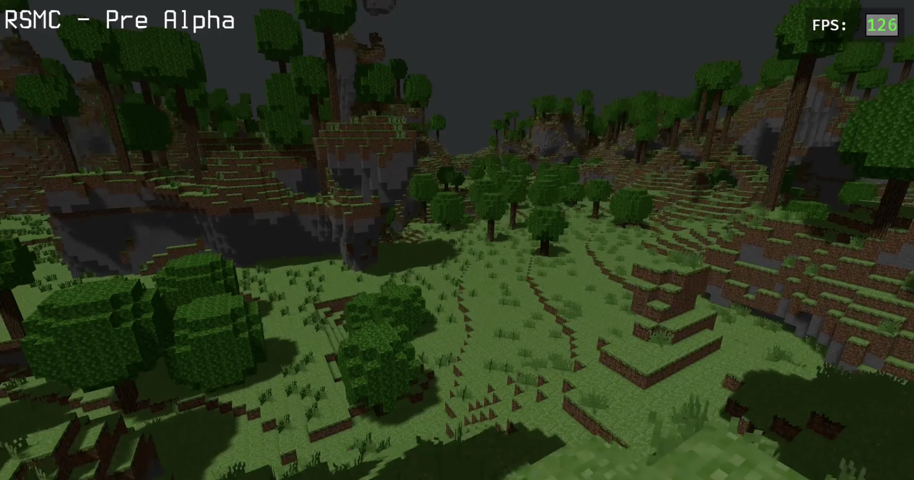

# RSMC

RSMC is the natural successor to [TSMC2](/projects/tsmc2). It is (yet again) a full rewrite in Rust and primarily a learning project to properly understand the Rust Programming language, its ecosystem and its constraints.

I once heard that beginner projects in Rust include writing a calculator, a browser, or an operating system. So as a first project I decided to build a multi threaded, blazingly fast, multiplayer voxel engine with a strict Client Server architecture.

The code should be taken with a grain of salt. Apart from Advent of Code, this is my first Rust project. An LLM would almost certainly write cleaner code, but generating solutions is not how I learn. I like my *old fashioned* paperback copy of [the Rust programming language](https://nostarch.com/rust-programming-language-3rd-edition).

The project is heavily developed through pull requests. Most features are documented there with sequence diagrams, screencasts and design notes. If you are interested in the technical details, feel free to dig through the PR history.

Repository: [https://github.com/cb341/rsmc](https://github.com/cb341/rsmc)

## Features

- Perlin based 3D noise terrain generation using a density function
- Simple cave generation
- Terrain modification placing and removing blocks
- Tree generation
- Basic collision handling
- Custom serialization and chunk compression
- Hybrid UDP / TCP client server communication
- In game chat with graphical user interface
- Extensive debug and visualization feature flags
- Custom occlusion based geometry builder
- Multithreaded terrain generation and meshing pipeline inspired by learnings from Zurich School of Engineering

## Development

